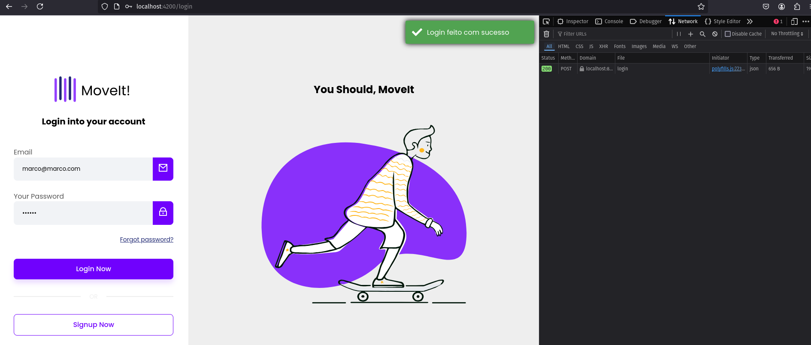
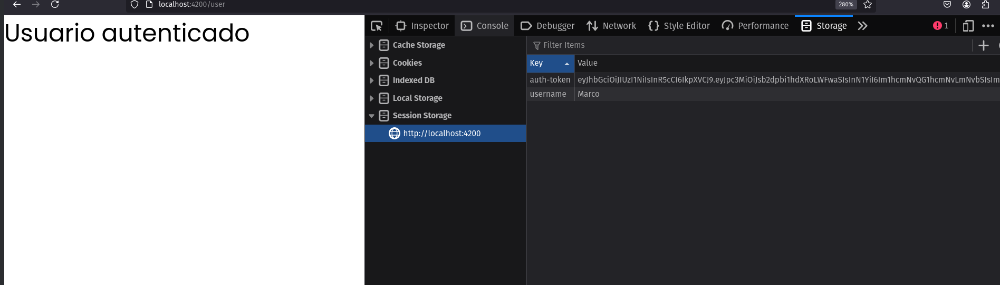

# Crud com autenticação simples

### Requisitos
- java versão 17
- node 22.5.1

abra o terminal dentro do projeto
```
cd crud
execute o projeto usando a idea, ou pelos comandos

gradle build
gradle run
```
execute:
```
cd src/main/resources/frontend 
npm i
npm install -g @angular/cli
ng serve
```
[acesse o projeto](http://localhost:4200)


#

#

#



